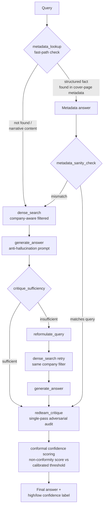

# Autonomous Research & Decision Co-Pilot

A RAG system over SaaS company 10-K filings with self-correction, adversarial auditing, and statistically calibrated confidence scoring.

## Results at a Glance

| Metric | Result |
|---|---|
| Retrieval quality (Module 1, `dense_search`, 28-query eval set) | **hit_rate@5 = 1.000**, **precision@1 = 0.893** — beat every hybrid/reranked variant tested |
| End-to-end answer correctness (Module 2+3, LLM-as-judge, 28 queries) | **20 / 28 correct** |
| Red-team audit catch rate on observed fabrications (Module 3) | **1 / 1 (100%, small sample)** |
| Calibrated confidence coverage (Module 4, split-conformal, 14 held-out queries, 80% target) | **83.3%** (5/6 high-confidence test cases actually correct) |

See "Known Limitations & Lessons Learned" below for the caveats behind each of these numbers — several are small-sample or were arrived at only after a failed detour.

## Problem Statement

RAG systems answer confidently even when the retrieved evidence is weak, contradictory, or simply absent — a fluent-sounding answer gives no signal about whether it should actually be trusted. Bolting an LLM-judge "confidence score" onto the output doesn't fix this either, since the same model can be equally fluent whether it's right or wrong. This project instead builds trust in layers: a self-correction loop that reformulates and retries when an answer is judged insufficient, an adversarial red-team audit that checks the single weakest claim in every generated answer against its source evidence, and a conformal-prediction calibration layer that turns those signals into a statistically grounded "trust this" / "review this" split — rather than asking the model how sure it feels.

## Architecture



## Module Summary

| Module | Description | README | Headline Metric |
|---|---|---|---|
| **Module 1** | Ingestion, chunking, dense embedding (bge-small-en-v1.5), BM25 sparse retrieval, RRF hybrid fusion, and cross-encoder reranking — evaluated against each other to choose a production retrieval method | [README_module1.md](README_module1.md) | Dense-only retrieval outperformed hybrid and hybrid+rerank on this corpus (1.000 hit_rate@5 / 0.893 precision@1 vs. hybrid's 0.964 / 0.679). Revisited and reconfirmed later — see Lessons Learned below |
| **Module 2** | LLM answer generation with anti-hallucination prompting, sufficiency critique, a self-correction retry/reformulation loop, and a structured metadata fast-path for cover-page facts | [README_module2.md](README_module2.md) | The metadata fast-path resolved a retrieval-layer limitation (dense retrieval could never surface Atlassian's "TEAM / Nasdaq" line) by routing structured fact lookups around it entirely |
| **Module 3** | A single-pass adversarial red-team audit that checks the single weakest claim in every generated answer, plus a metadata-routing bug fix and company-aware retrieval filtering | [README_module3.md](README_module3.md) | The red-team audit caught an LLM fabrication with a **100% observed catch rate** (1/1) on a small sample when the underlying generation hallucinated |
| **Module 4** | Calibrated confidence via split-conformal prediction over a continuous non-conformity score (audit status + retrieval similarity + spread + length), replacing a degenerate discrete-score first attempt | [README_module4.md](README_module4.md) | **83.3% empirical coverage** against an 80% target on a held-out 14-query test set |

## Known Limitations & Lessons Learned

The highlights below are pulled together from all 4 modules — see each module's README for full detail. This is the honest version of "what actually happened," not just the numbers that made it into the final pipeline.

- **A retrieval-method reversal, then a revert — the single biggest lesson in this project.** Module 1's dense-vs-hybrid decision was originally settled by source-file-match grading (dense won). A later re-evaluation using an LLM-as-judge to grade *content relevance* instead (even after fixing a cross-company leniency bug in the judge itself) showed `hybrid_rerank_search` winning instead, and production retrieval was switched to it. But an end-to-end check — rebuilding the full calibration dataset and re-running conformal calibration — showed this made the *actual system* worse, not better: final-answer correctness dropped (19→18/28) and calibrated-confidence coverage collapsed from 87.5% to **44.4%** against an 80% target. The switch was reverted back to `dense_search`, restoring ~20/28 correctness and 83.3% coverage. **The lesson: a retrieval method that scores better on an isolated, chunk-level relevance metric is not guaranteed to produce a better end-to-end system** — generation, self-correction, and auditing all sit downstream of retrieval and can respond to a retrieval change in non-obvious ways. Any future retrieval change needs a full pipeline validation, not just a component-level eval, before being adopted. Full writeup: [README_module1.md](README_module1.md)'s Decision Reversal Investigation section.
- **A cross-company contamination bug in retrieval, found and fixed.** Manual review of failing answers surfaced cases where the model cited facts from the *wrong company's* filing (e.g., Zoom-sourced content bleeding into an Atlassian answer). Direct `dense_search` inspection confirmed wrong-company chunks were genuinely present in the top-5 — a retrieval problem, not a generation hallucination. The fix: a `detect_company()` check that applies a ChromaDB metadata `where` filter to constrain retrieval to the named company, eliminating the contamination (verified 0/5 wrong-company chunks post-fix, down from up to 3/5 on the worst affected query). Full writeup: [README_module3.md](README_module3.md).
- **LLM non-determinism observed directly, not just theorized.** The same query, same retrieved context, and same model (`llama3.1:8b`) was run 6 times in a row. It correctly abstained ("I don't have enough information...") 5 times and fabricated a plausible-looking but unsupported percentage breakdown once — a **1/6 fabrication rate** with zero code changes between runs. This is the concrete evidence motivating the entire self-correction, audit, and calibration stack: no single generation pass can be trusted at face value, however well-prompted. Full writeup: [README_module3.md](README_module3.md).
- **The conformal calibration layer was degenerate on its first attempt, then fixed.** Using only Module 3's 4-value `audit_status` as the non-conformity score produced a calibration threshold that landed exactly on the score ceiling, meaning literally every test case was labeled "high confidence" — the 87.5%-looking "coverage" was actually just raw accuracy in disguise, with zero real discrimination. Replacing it with a continuous score (audit status + retrieval-similarity, retrieval-spread, and answer-length adjustments) produced a threshold inside the actual score distribution and correctly split several held-out test cases into "low confidence — review recommended," restoring real discrimination. Full writeup: [README_module4.md](README_module4.md).
- **A genuine multi-hop reasoning limitation, investigated but deliberately not "fixed" with a blanket change.** A test question requiring Atlassian's VFT equity-investment note (Note 4) and its resulting $912.3M lease commitment (Note 9) to be connected showed a two-factor failure: at k=5, retrieval simply missed one of the two needed sections (a recall problem, correctly caught by `critique_sufficiency`); widening retrieval to k=12 as a bounded test fixed recall — both sections were retrieved, one even explicitly cross-referencing the other — but generation got *worse*, flipping from a partial-but-honest answer to a confident abstention, because the noisier 12-chunk context (10/12 irrelevant) pushed the conservative anti-hallucination prompt toward giving up rather than connecting the two relevant threads. **Widening k alone is not a sufficient fix** — this needs either a generation-prompt adjustment for noisy wide contexts or a real multi-hop retrieval mechanism (e.g., following in-document cross-references), which is exactly why GraphRAG and multi-agent reasoning were scoped out of this project from the start rather than retrofitted here. Full writeup: [README_module2.md](README_module2.md)'s Multi-Hop Reasoning section.
- **Small sample sizes throughout should temper every number above.** 28 eval queries, 14 calibration + 14 test queries, and single-digit fabrication/catch-rate counts are all too small to treat as statistically stable estimates — they're illustrative of the mechanisms working, not production-grade confidence intervals. A larger hand-labeled eval set is the highest-leverage next step for making every number in this README more trustworthy.

## Tech Stack

Entirely local and free — no paid APIs required:

- **[Ollama](https://ollama.com/)** running **`llama3.1:8b`** — local LLM for generation, critique, reformulation, red-team auditing, and metadata extraction
- **`sentence-transformers`** — dense embeddings via **`BAAI/bge-small-en-v1.5`**, and cross-encoder reranking via **`cross-encoder/ms-marco-MiniLM-L-6-v2`**
- **ChromaDB** — persistent local vector store with metadata `where`-filtering for company-aware retrieval
- **`rank_bm25`** — BM25Okapi sparse retrieval (Module 1 comparison; retained for reference, not production)
- **`pypdf`** + **`langchain-text-splitters`** — PDF ingestion and chunking
- **Custom split-conformal prediction** implementation (no `mapie` dependency — the calibration procedure in `src/stage4_conformal.py` is a small, self-contained implementation of standard split-conformal calibration)
- **Streamlit** (`app.py`) — local UI wrapping `generate_report()`

## What I'd Build Next

**Originally scoped-out modules:**
- **GraphRAG** — entity/relationship graph over the filings to support multi-hop and cross-document comparison queries (e.g., "compare R&D spend growth across all 5 companies")
- **Multi-agent debate** — multiple independent generation passes with a structured disagreement/consensus step, as a richer alternative to the current single-pass self-correction loop
- **Fine-tuning** — a small fine-tuned model specialized for 10-K-style extraction and citation, rather than relying entirely on prompting a general-purpose local model
- **Long-term memory** — persistent memory of prior queries/answers across sessions, so repeated or related questions don't restart from zero context

**Specific improvements identified during testing:**
- **A sharper non-conformity signal for Module 4** — `flagged` cases still cluster fairly tightly even after adding similarity/spread/length signals; a cross-encoder rerank score (currently unused in production) is the next candidate for a decorrelated signal
- **A larger calibration set** — 14/14 calibration/test queries is too small to treat the 83.3% coverage figure as a stable estimate; a larger hand-labeled eval set would tighten this considerably
- **Reconcile Module 4's confidence signal with production retrieval** — `get_retrieval_chunks` always re-runs `dense_search` for its similarity/spread signal regardless of which method actually produced the answer being scored. This is currently consistent (both are `dense_search`), but it's a silent coupling that would need attention if Module 1's decision is ever reopened — see the reversal-and-revert lesson above.
- **LLM-judge-based grading throughout** — the switch from strict keyword substring-matching to an LLM-as-judge grader (Module 4) eliminated a meaningful number of false negatives; earlier evaluation steps (Module 1's retrieval eval) still use simpler heuristics and could benefit from the same upgrade

## Project Layout

```
research-copilot/
  documents/           # source 10-K PDFs (tracked in git)
  src/                 # production pipeline: stage1_ingest.py ... stage4_conformal.py,
                        # stage_generate.py, stage_final_report.py, report_schema.py,
                        # extract_metadata.py, evaluate_retrieval.py
  eval/                # eval_set.json, eval_set_additions.json, calibration_dataset.json
  reports/             # sample generated reports (report_1.md, report_2.md, report_3.md)
  experiments/         # retired/debug scripts kept for evidentiary value (not production)
  app.py               # Streamlit UI entry point
  requirements.txt
  README.md, README_module1.md .. README_module4.md
  LICENSE
```

## How to Run It

1. **Set up the Python environment:**
   ```
   python -m venv venv
   .\venv\Scripts\python.exe -m pip install -r requirements.txt
   ```

2. **Install and start Ollama, then pull the model:**
   ```
   ollama pull llama3.1:8b
   ```
   Verify it's available with `ollama list` before running any Module 2+ script — several scripts assume a reachable local Ollama server on `localhost:11434` and will fail without one.

3. **Source documents:** the 5 SEC 10-K PDFs are already included in `documents/` in this repo.

4. **Run the pipeline stages in order** (from the repo root):
   ```
   .\venv\Scripts\python.exe src\stage1_ingest.py          # PDF -> src/chunks.json
   .\venv\Scripts\python.exe src\stage2_embed.py            # chunks.json -> ChromaDB collection (src/chroma_db)
   .\venv\Scripts\python.exe src\extract_metadata.py         # PDF cover pages -> src/company_metadata.json
   .\venv\Scripts\python.exe src\evaluate_retrieval.py       # Module 1 retrieval evaluation (optional)
   .\venv\Scripts\python.exe src\stage_generate.py           # Module 2 generation smoke test
   .\venv\Scripts\python.exe src\stage2_self_correct.py      # Module 2 self-correction + metadata fast-path test
   .\venv\Scripts\python.exe src\stage3_redteam.py           # Module 3 red-team audit test
   .\venv\Scripts\python.exe src\stage4_build_labels.py      # Build eval/calibration_dataset.json
   .\venv\Scripts\python.exe src\stage4_conformal.py         # Module 4 conformal calibration + coverage report
   .\venv\Scripts\python.exe src\stage_final_report.py       # Generate the 3 sample reports/ files
   ```

   `src/stage3_hybrid.py` and `src/stage4_rerank.py` are retained for reference/comparison (see Module 1's README) and are not part of the production run order above.

5. **Run the UI:**
   ```
   .\venv\Scripts\python.exe -m streamlit run app.py
   ```

See each module's README (linked in the table above) for full design details, test results, and known limitations.

## License

MIT — see [LICENSE](LICENSE).
