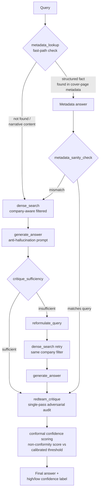

# Autonomous Research & Decision Co-Pilot

A RAG system over SaaS company 10-K filings with self-correction, adversarial auditing, and statistically calibrated confidence scoring.

## Problem Statement

RAG systems answer confidently even when the retrieved evidence is weak, contradictory, or simply absent — a fluent-sounding answer gives no signal about whether it should actually be trusted. Bolting an LLM-judge "confidence score" onto the output doesn't fix this either, since the same model can be equally fluent whether it's right or wrong. This project instead builds trust in layers: a self-correction loop that reformulates and retries when an answer is judged insufficient, an adversarial red-team audit that checks the single weakest claim in every generated answer against its source evidence, and a conformal-prediction calibration layer that turns those signals into a statistically grounded "trust this" / "review this" split — rather than asking the model how sure it feels.

## Architecture



## Module Summary

| Module | Description | README | Headline Metric |
|---|---|---|---|
| **Module 1** | Ingestion, chunking, dense embedding (bge-small-en-v1.5), BM25 sparse retrieval, RRF hybrid fusion, and cross-encoder reranking — evaluated against each other to choose a production retrieval method | [README_module1.md](README_module1.md) | Dense-only retrieval outperformed hybrid and hybrid+rerank on this corpus (1.000 hit_rate@5 / 0.893 precision@1 vs. hybrid's 0.964 / 0.679) |
| **Module 2** | LLM answer generation with anti-hallucination prompting, sufficiency critique, a self-correction retry/reformulation loop, and a structured metadata fast-path for cover-page facts | [README_module2.md](README_module2.md) | The metadata fast-path resolved a retrieval-layer limitation (dense retrieval could never surface Atlassian's "TEAM / Nasdaq" line) by routing structured fact lookups around it entirely |
| **Module 3** | A single-pass adversarial red-team audit that checks the single weakest claim in every generated answer, plus a metadata-routing bug fix and company-aware retrieval filtering | [README_module3.md](README_module3.md) | The red-team audit caught an LLM fabrication with a **100% observed catch rate** (1/1) on a small sample when the underlying generation hallucinated |
| **Module 4** | Calibrated confidence via split-conformal prediction over a continuous non-conformity score (audit status + retrieval similarity), replacing a degenerate discrete-score first attempt | [README_module4.md](README_module4.md) | **87.5% empirical coverage** against an 80% target on a held-out 14-query test set |

## Key Engineering Findings

- **Dense-only retrieval beat hybrid (BM25 + RRF fusion + reranking) on this corpus.** Across a 28-query eval set and three repeated stability runs (zero variance), plain dense embedding search outperformed every hybrid variant on both hit_rate@5 and precision@1 — likely because heavy boilerplate overlap across 10-K filings makes keyword-based BM25 matching less discriminative than semantic matching here. Documented in [README_module1.md](README_module1.md).
- **A cross-company contamination bug in retrieval, found and fixed.** Manual review of failing answers surfaced cases where the model cited facts from the *wrong company's* filing (e.g., Zoom-sourced content bleeding into an Atlassian answer). Direct `dense_search` inspection confirmed wrong-company chunks were genuinely present in the top-5 — a retrieval problem, not a generation hallucination. The fix: a `detect_company()` check that applies a ChromaDB metadata `where` filter to constrain retrieval to the named company, eliminating the contamination (verified 0/5 wrong-company chunks post-fix, down from up to 3/5 on the worst affected query).
- **LLM non-determinism observed directly, not just theorized.** The same query, same retrieved context, and same model (`llama3.1:8b`) was run 6 times in a row. It correctly abstained ("I don't have enough information...") 5 times and fabricated a plausible-looking but unsupported percentage breakdown once — a **1/6 fabrication rate** with zero code changes between runs. This is the concrete evidence motivating the entire self-correction, audit, and calibration stack: no single generation pass can be trusted at face value, however well-prompted.
- **The conformal calibration layer was degenerate on its first attempt, then fixed.** Using only Module 3's 4-value `audit_status` as the non-conformity score produced a calibration threshold that landed exactly on the score ceiling, meaning literally every test case was labeled "high confidence" — the 87.5%-looking "coverage" was actually just raw accuracy in disguise, with zero real discrimination. Replacing it with a continuous score (audit status + a retrieval-similarity adjustment) produced a threshold inside the actual score distribution and correctly split 6/14 held-out test cases into "low confidence — review recommended," restoring real discrimination.

## Tech Stack

Entirely local and free — no paid APIs required:

- **[Ollama](https://ollama.com/)** running **`llama3.1:8b`** — local LLM for generation, critique, reformulation, red-team auditing, and metadata extraction
- **`sentence-transformers`** — dense embeddings via **`BAAI/bge-small-en-v1.5`**, and cross-encoder reranking via **`cross-encoder/ms-marco-MiniLM-L-6-v2`**
- **ChromaDB** — persistent local vector store with metadata `where`-filtering for company-aware retrieval
- **`rank_bm25`** — BM25Okapi sparse retrieval (Module 1 comparison; retained for reference, not production)
- **`pypdf`** + **`langchain-text-splitters`** — PDF ingestion and chunking
- **Custom split-conformal prediction** implementation (no `mapie` dependency — the calibration procedure in `stage4_conformal.py` is a small, self-contained implementation of standard split-conformal calibration)

## What I'd Build Next

**Originally scoped-out modules:**
- **GraphRAG** — entity/relationship graph over the filings to support multi-hop and cross-document comparison queries (e.g., "compare R&D spend growth across all 5 companies")
- **Multi-agent debate** — multiple independent generation passes with a structured disagreement/consensus step, as a richer alternative to the current single-pass self-correction loop
- **Fine-tuning** — a small fine-tuned model specialized for 10-K-style extraction and citation, rather than relying entirely on prompting a general-purpose local model
- **Long-term memory** — persistent memory of prior queries/answers across sessions, so repeated or related questions don't restart from zero context

**Specific improvements identified during testing:**
- **A sharper non-conformity signal for Module 4** — the current score clusters tightly (most `flagged` cases fall in a narrow 0.83–0.85 band); adding retrieval-score spread across all 5 chunks, answer length, and the (currently unused-in-production) cross-encoder rerank score as additional weakly-correlated signals should widen and smooth the score distribution
- **A larger calibration set** — 14/14 calibration/test queries is too small to treat the 87.5% coverage figure as a stable estimate; a larger hand-labeled eval set would tighten this considerably
- **LLM-judge-based grading throughout** — the switch from strict keyword substring-matching to an LLM-as-judge grader (Module 4) eliminated a meaningful number of false negatives; earlier evaluation steps (Module 1's retrieval eval) still use simpler heuristics and could benefit from the same upgrade

## How to Run It

1. **Set up the Python environment:**
   ```
   python -m venv venv
   .\venv\Scripts\python.exe -m pip install -r requirements.txt
   ```

2. **Install and start Ollama, then pull the model:**
   ```
   ollama pull llama3.1:8b
   ```
   Verify it's available with `ollama list` before running any Module 2+ script — several scripts assume a reachable local Ollama server on `localhost:11434` and will fail without one.

3. **Supply the source documents:** place the 5 SEC 10-K PDFs in `documents/` (not included in this repo — see `.gitignore`).

4. **Run the pipeline stages in order:**
   ```
   .\venv\Scripts\python.exe stage1_ingest.py          # PDF -> chunks.json
   .\venv\Scripts\python.exe stage2_embed.py            # chunks.json -> ChromaDB collection
   .\venv\Scripts\python.exe extract_metadata.py         # PDF cover pages -> company_metadata.json
   .\venv\Scripts\python.exe evaluate_retrieval.py       # Module 1 retrieval evaluation (optional)
   .\venv\Scripts\python.exe stage_generate.py           # Module 2 generation smoke test
   .\venv\Scripts\python.exe stage2_self_correct.py      # Module 2 self-correction + metadata fast-path test
   .\venv\Scripts\python.exe stage3_redteam.py           # Module 3 red-team audit test
   .\venv\Scripts\python.exe stage4_build_labels.py      # Build calibration_dataset.json
   .\venv\Scripts\python.exe stage4_conformal.py         # Module 4 conformal calibration + coverage report
   ```

   `stage3_hybrid.py` and `stage4_rerank.py` are retained for reference/comparison (see Module 1's README) and are not part of the production run order above.

See each module's README (linked in the table above) for full design details, test results, and known limitations.
